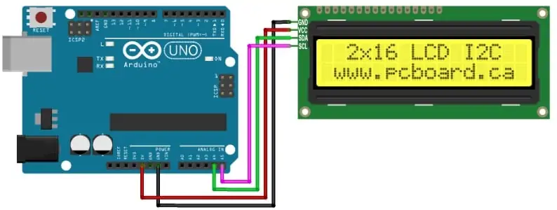
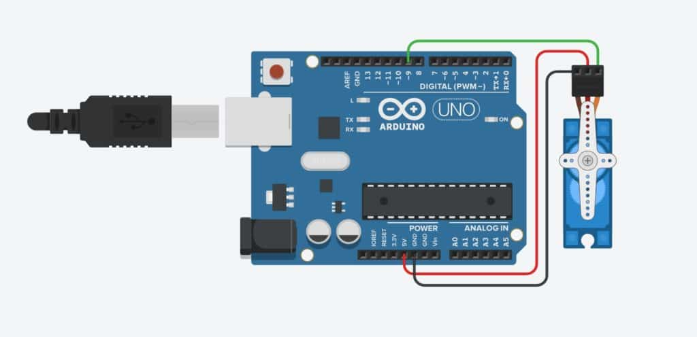
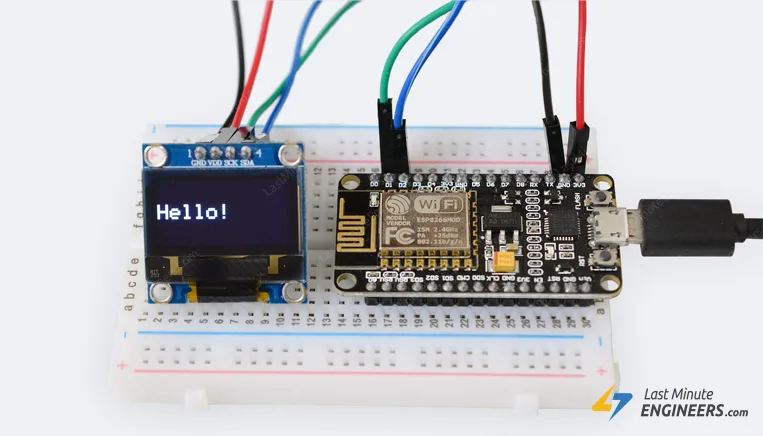

# Projetos de Visão Computacional, Deep Learning e Arduino

Este repositório combina **Visão Computacional, Deep Learning e Arduino**, onde se desenvolvem **dois projetos interativos** utilizando ferramentas como **MediaPipe** e **OpenCV**:

## 🚀 Projetos

1. **🖥️ Controle de LCD com Movimentos Faciais**  
   Controla um display LCD usando expressões e movimentos faciais.

2. **🤖 Controle de Braço Robótico**  
   Manipula um braço robótico através de visão computacional.

## 🎯 O que pode esperar

- **🔌 Comunicação serial** entre Python e Arduino
- **👁️ Detecção facial e landmarks** usando MediaPipe
- **🖥️ Aplicações com display LCD e motores servo**
- **📷 Técnicas de processamento de imagens** com OpenCV

## 🛠️ Tecnologias utilizadas

- Python 3.12
- OpenCV
- MediaPipe
- Arduino
- LCD e Servo Motors

## 📦 Pré-requisitos Arduino

Para utilizar o LCD via I2C, é necessário:

1. **Fazer o download da biblioteca Arduino LiquidCrystal I2C**:  
   [https://github.com/fdebrabander/Arduino-LiquidCrystal-I2C-library](https://github.com/fdebrabander/Arduino-LiquidCrystal-I2C-library)

2. **Instalar o Arduino IDE**:  
   [https://www.arduino.cc/en/software/](https://www.arduino.cc/en/software/)

3. **Adicionar a biblioteca ZIP no Arduino IDE**:

   - Abra o Arduino IDE
   - Vá a **Sketch → Incluir Biblioteca → Adicionar Biblioteca .ZIP**
   - Selecione o arquivo ZIP da biblioteca baixada

4. As ligações do **Arduino Leonardo** ao módulo **LiquidCrystal I2C**:

5. As ligações para o projecto arduino braço web camara
   

6. As ligações do **ESP8266WiFi** ao módulo **oled 128x64 i2c**:
   
